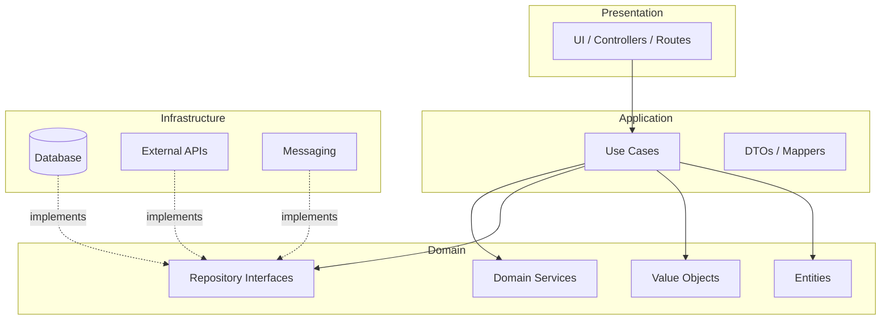

# Clean Architecture Overview

## Dependency Flow

## Rules

1. **Domain has zero outward dependencies** — no frameworks, no HTTP, no DB drivers.
2. **Use cases coordinate** — one use case = one application action; no UI logic.
3. **Infrastructure implements interfaces** — defined in domain or application.
4. **Presentation is thin** — parse input, call use case, map output to response/view.

## Monorepo Boundaries

| Surface | Presentation | Shared domain |
|---------|--------------|---------------|
| Mobile | screens, navigation | `packages/domain-core` |
| Backend | HTTP controllers | `packages/domain-core` |
| Admin | pages, routes | `packages/domain-core` |

Database schema and migrations remain in `database/`, not inside backend domain code.
