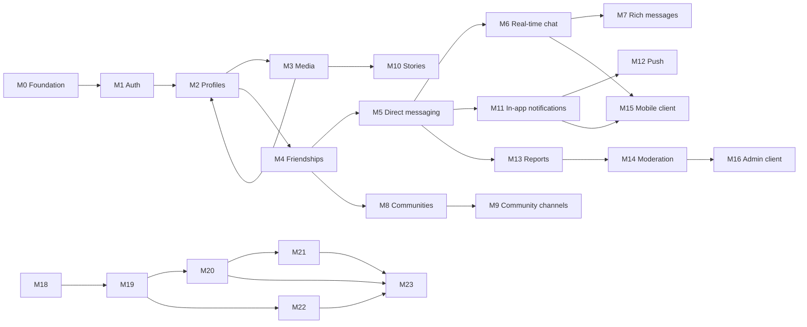

# Development Roadmap

Social and messaging platform (monorepo: `backend`, `mobile`, `admin`, `database`, `packages`, `infrastructure`). Schema and folder scaffolding exist; **no feature code is implemented yet**.

## Principles

1. **One major system per milestone** — finish and stabilize before starting the next domain (no parallel auth + messaging + communities).
2. **Independently testable** — each milestone ships automated checks and a manual smoke path documented in its exit criteria.
3. **Backend-first for domain logic** — HTTP/REST (or RPC) is the contract; clients attach in dedicated later milestones.
4. **Incremental real-time** — WebSockets extend an existing REST feature; they are never built in the same milestone as the initial REST surface for that feature.
5. **Clean Architecture per surface** — domain rules live in `domain` / `packages/domain-core`; DB access only in infrastructure.

## Major systems map

---

## Milestone 0 — Platform foundation

**Scope:** Runnable local stack, migration pipeline, empty backend shell, shared package wiring, CI smoke. **Not in scope:** business features, mobile/admin apps.

| Work | Surfaces |
|------|----------|
| Local PostgreSQL 18+ (native install) | `database/` |
| Apply `database/schemas/001_initial_schema.sql` via migrations tooling | `database/` |
| Backend bootstrap: health route, config, logging, DI/composition root, layer folders | `backend/` |
| `packages/shared-types`: enums aligned with DB (`user_status`, etc.) | `packages/` |
| CI: lint + unit test job on PR | `infrastructure/ci/` |

**Exit criteria (testable):**

- [x] Local PostgreSQL running; `npm run db:migrate` applies cleanly on a fresh database.
- [x] `GET /health` returns 200 with DB connectivity check.
- [x] CI passes on default branch with at least one placeholder unit test per package.

**Manual smoke:** Clone repo → install/start Postgres → migrate → curl health.

---

## Milestone 1 — Identity and authentication

**Scope:** Account lifecycle, credentials, sessions, devices. **Not in scope:** profiles, social graph, messaging.

| Work | Details |
|------|---------|
| Register | Email and/or phone; password hash (Argon2/bcrypt); `users.status` pending → active |
| Login / refresh / logout | Opaque refresh tokens; `sessions` + `refresh_token_hash`; rotation on refresh |
| Session revoke | Single session and all sessions for user |
| Device register/update | `devices` row; optional push token field stored but unused until M12 |
| Auth middleware | Bearer access JWT or session model (choose in ADR); enforce `suspended` / `deactivated` |
| Domain + use cases | RegisterUser, Login, RefreshSession, Logout, RevokeSession, RegisterDevice |

**Exit criteria:**

- [x] Integration tests: register → login → refresh → logout; revoked refresh fails.
- [x] Integration tests: suspended user cannot obtain valid access token.
- [x] No profile or messaging tables written except `users` (+ sessions/devices).

**Manual smoke:** Two test users created via API; second device login creates two active sessions; logout one device leaves other valid.

---

## Milestone 2 — Profiles and public aliases

**Scope:** Public identity (`profiles`, `public_aliases`). **Not in scope:** avatar media (M3), friendships, search index at scale.

| Work | Details |
|------|---------|
| Create profile on activation | Default `display_name`, locale, timezone |
| Update profile | bio, discoverability, locale, timezone |
| Primary alias | Claim, rename (history via `active_until`), uniqueness rules |
| Read profile | By user id and by primary `@alias` |
| Shared types | Profile DTOs in `packages/shared-types` |

**Exit criteria:**

- [x] Integration tests: alias format validation; duplicate alias rejected; rename preserves history.
- [x] Integration tests: profile CRUD only for authenticated owner (or public read where designed).
- [x] `avatar_media_id` remains null in tests (optional stub FK only).

**Manual smoke:** User sets alias → fetch public profile by alias without auth (if product allows public read).

---

## Milestone 3 — Media upload pipeline

**Scope:** Object storage, upload lifecycle, metadata in `media` / `media_variants`. **Not in scope:** attaching media to messages or stories (later milestones).

| Work | Details |
|------|---------|
| Init upload | Presigned URL or multipart policy; row in `media` with `uploading` |
| Complete upload | Checksum, size, mime; transition to `ready` (or `processing` → worker → `ready`) |
| Variants | Thumbnail generation job (minimal: one `thumbnail` variant for images) |
| Delete | Soft delete `deleted_at`; enforce uploader ownership |
| Wire avatars | Profile/community `avatar_media_id` update use cases |

**Exit criteria:**

- [x] Integration tests: full upload flow; non-owner cannot complete another user’s upload.
- [x] Integration tests: profile avatar round-trip after M2 profile APIs.
- [x] Failed upload marks `failed`; ready media retrievable via signed GET URL.

**Manual smoke:** Upload image → set as avatar → fetch profile shows avatar URL.

---

## Milestone 4 — Friendships (social graph)

**Scope:** Dyadic relationships only. **Not in scope:** communities, messaging, recommendations.

| Work | Details |
|------|---------|
| Send / accept / decline request | Canonical `user_id_low` / `user_id_high` ordering |
| Block | `friendship_status` blocked; document asymmetry rules in ADR |
| List friends / pending | Incoming vs outgoing pending |
| Enforcement hooks | Interface used later by DM (M5): “can these users interact?” |

**Exit criteria:**

- [x] Integration tests: duplicate request idempotent or rejected; accept from wrong user fails.
- [x] Integration tests: blocked user cannot send friend request (per product rule).
- [x] Unit tests: ordering invariant for pair uniqueness.

**Manual smoke:** A requests B → B accepts → both see friendship in list.

---

## Milestone 5 — Direct messaging (REST)

**Scope:** 1:1 conversations and text messages via HTTP only. **Not in scope:** WebSockets, group chat, community channels, media attachments.

| Work | Details |
|------|---------|
| Create/get DM | `conversation_type = direct`; two participants; friends-only or policy from M4 |
| Send text message | `message_type = text`; pagination by `created_at` |
| Edit / soft-delete | `edited_at`, `deleted_at` |
| Read state | Update `conversation_participants.last_read_at` |
| Mute | `is_muted` on participant |

**Exit criteria:**

- [x] Integration tests: non-participant cannot read thread; cannot message non-friend if policy requires friendship.
- [x] Integration tests: pagination stable ordering; edit/delete visibility rules.
- [ ] Load test optional: 1k messages in thread paginate under SLA (document baseline).

**Manual smoke:** Two friends exchange messages via REST only; unread state changes after mark-read.

---

## Milestone 6 — Real-time messaging transport

**Scope:** WebSocket (or SSE) layer **for existing direct chat only**. **Not in scope:** new message types, groups, push.

| Work | Details |
|------|---------|
| WS auth | Same tokens as M1; reconnect handling |
| Rooms | Join per `conversation_id`; authorize participant |
| Events | `message.created`, `message.updated`, `message.deleted`, typing optional |
| Fan-out | Publish on REST write path; idempotent event ids |

**Exit criteria:**

- [x] Integration tests: WS receives event after REST send; non-member subscription rejected.
- [x] Contract test: event payload matches `packages/shared-types` schema.
- [x] Manual: two clients; message appears on B without poll within N seconds.

**Manual smoke:** Mobile curl/CLI client + second connection sees live message.

---

## Milestone 7 — Rich messages (media and location)

**Scope:** Extend messaging with attachments and location. **Not in scope:** new conversation types.

| Work | Details |
|------|---------|
| Media messages | `message_media` junction; reuse M3 upload flow |
| Location messages | `locations` row + `message_type = location` |
| System messages | Join/leave placeholders for future groups (optional, direct-only stub) |
| WS events | Extend M6 payloads for new message types |

**Exit criteria:**

- [x] Integration tests: media message requires `ready` media; location validates lat/long.
- [x] WS clients receive enriched payloads without breaking text-only clients (version field).

**Manual smoke:** Send image in DM; recipient fetches history with media URLs.

---

## Milestone 8 — Communities

**Scope:** Groups, membership, roles, visibility. **Not in scope:** community channel conversations (M9).

| Work | Details |
|------|---------|
| CRUD community | slug uniqueness; owner; `visibility` |
| Join / leave / invite | Private/hidden rules |
| Roles | owner, admin, moderator, member; transfer owner |
| Avatar | Reuse M3 for `avatar_media_id` |

**Exit criteria:**

- [x] Integration tests: role matrix (only admin+ can update settings); archived community read-only.
- [x] Integration tests: hidden community not listed publicly.

**Manual smoke:** Create community → second user joins as member → role promotion works.

---

## Milestone 9 — Community channel messaging

**Scope:** `conversation_type = community_channel` tied to M8. **Not in scope:** stories, moderation UI.

| Work | Details |
|------|---------|
| Channel CRUD | Linked to `community_id`; member-only post/read |
| Participant model | Auto membership from community or explicit channel members (ADR) |
| REST + WS | Reuse M5/M6 patterns with community permission checks |
| Rich messages | Reuse M7 in channels |

**Exit criteria:**

- [ ] Integration tests: non-member cannot read channel; moderator delete message (if in scope).
- [ ] WS room authorization uses community membership cache or DB check.

**Manual smoke:** Post in `#general` channel; member sees live update.

---

## Milestone 10 — Stories

**Scope:** Ephemeral stories (`stories`, `story_items`, `story_views`). **Not in scope:** notifications for new stories (M11).

| Work | Details |
|------|---------|
| Create story | Multiple `story_items`; `expires_at` default TTL |
| Feed | Friends’ active stories (depends M4 graph) |
| View tracking | `story_views` idempotent |
| Expiry job | Cron/worker soft-deletes or hard-deletes expired |
| Media | Reuse M3 |

**Exit criteria:**

- [x] Integration tests: expired story not in feed; view count/idempotency.
- [x] Job test: story past `expires_at` removed from active index.

**Manual smoke:** Post 24h story → friend views → appears in viewed list for author.

---

## Milestone 11 — In-app notifications

**Scope:** `notifications` inbox + `notification_preferences`. **Not in scope:** push delivery (M12).

| Work | Details |
|------|---------|
| Emit events | Friend request, new message (direct + channel), story optional |
| Inbox API | List, unread count, mark read |
| Preferences | Per `notification_type` × `channel`; disable in_app |
| Payload schema | JSONB deep links documented in `docs/api/` |

**Exit criteria:**

- [x] Integration tests: preference off → no row created for that type.
- [x] Integration tests: mark read clears unread index.

**Manual smoke:** Send message → recipient inbox shows notification with correct payload.

---

## Milestone 12 — Push notifications

**Scope:** Device push via FCM/APNs/WebPush using M1 `devices.push_token`. **Not in scope:** email/SMS channels.

| Work | Details |
|------|---------|
| Provider adapter | Sandbox credentials in dev |
| Dispatch worker | Consumes same events as M11; respects preferences for `push` channel |
| Token lifecycle | Invalidate on `revoked_at` device |

**Exit criteria:**

- [x] Integration tests with provider mocks: push enqueued when in_app + push enabled.
- [x] Test device in sandbox receives payload (manual checklist).

**Manual smoke:** Background app receives push for new message.

---

## Milestone 13 — User reports

**Scope:** `reports` + `report_subjects`. **Not in scope:** moderator workflow (M14).

| Work | Details |
|------|---------|
| Submit report | Reason codes; polymorphic subjects (user, message, community, story, media) |
| Reporter limits | Rate limit; cannot report self |
| Status | Stays `open` until M14 |

**Exit criteria:**

- [x] Integration tests: subject validation; duplicate report policy (allow or dedupe — document).
- [x] Authorization: only participants can report a private message.

**Manual smoke:** Report a message → report id returned → reporter can fetch own report status.

---

## Milestone 14 — Moderation and sanctions

**Scope:** `moderation_cases`, `moderation_actions`, `user_sanctions`; enforcement in auth and content APIs. **Not in scope:** full admin UI polish (M16).

| Work | Details |
|------|---------|
| Case queue API | List/filter/assign; link optional `report_id` |
| Actions | warn, mute, suspend, ban, remove_content, dismiss |
| Sanctions | Enforce mute/suspend/ban on login and send message |
| Content removal | Soft-delete messages/stories per action |
| Audit | Immutable `moderation_actions` log |

**Exit criteria:**

- [x] Integration tests: suspended user blocked at M1 and M5; mute blocks send only.
- [x] Integration tests: remove_content hides message from history.
- [x] Role guard: only moderator/admin roles (define moderator flag on user or separate table in ADR).

**Manual smoke:** Open case from M13 report → ban user → user login fails.

---

## Milestone 15 — Mobile client (core flows)

**Scope:** **Presentation only** for milestones M1–M7, M11 (in-app). **Not in scope:** communities UI, stories, push (until M12 backend done), admin.

| Work | Details |
|------|---------|
| App shell | Navigation, theme, error handling |
| Auth screens | Register, login, session persist |
| Profile | View/edit, alias |
| Friends | List, requests |
| Chat | Thread list, DM UI, REST + WS from M6 |
| Media picker | Upload via M3; show in M7 |
| Notifications | In-app inbox |

**Exit criteria:**

- [x] Detox/Maestro (or agreed E2E): login → send message → receive via WS on second simulator.
- [x] Unit tests: use cases with mocked repositories.

**Manual smoke:** Full friend chat on two physical devices.

---

## Milestone 16 — Admin dashboard (moderation)

**Scope:** Web admin for M14 (+ read-only views for reports M13). **Not in scope:** general user administration beyond moderation, mobile features.

| Work | Details |
|------|---------|
| Moderator auth | Reuse M1 with role check |
| Case queue UI | Assign, resolve, action forms |
| Subject preview | Safe preview of reported message/user/community |
| Audit trail | Read `moderation_actions` |

**Exit criteria:**

- [x] E2E: login as moderator → resolve case → subject content state matches API.
- [x] Access control tests: non-moderator cannot access admin routes.

**Manual smoke:** Triage report end-to-end from M13 submission.

---

## Milestone 17 — Mobile: communities, stories, push (client)

**Scope:** Mobile UI for M8–M10, M12. **Not in scope:** new backend domains.

| Work | Details |
|------|---------|
| Communities | Discover, join, channel list |
| Channel chat | Reuse chat components from M15 |
| Stories | Capture, publish, viewer |
| Push | OS permission, token register, tap deep link |

**Exit criteria:**

- [x] E2E: join community → post in channel → receive push on mention/message (if enabled).
- [x] Story viewer records view (API from M10).

---

## Milestone 18 — Hardening and production readiness

**Scope:** Cross-cutting quality; **not a feature milestone**. Run after M16 or M17 depending on launch target.

| Work | Details |
|------|---------|
| Observability | Structured logs, metrics, tracing on backend |
| Rate limiting | Auth, report, message send |
| Backups | Postgres + object storage policy |
| Security review | OWASP API, token storage, presigned URL TTL |
| Load / soak | WS connection count, message fan-out |
| Terraform/staging | `infrastructure/terraform` staging environment |

**Exit criteria:**

- [x] Documented SLOs; alert on error rate and latency.
- [x] Game day: restore DB backup to staging.
- [x] Pen test or automated DAST baseline clean.

---

## Milestone 19-23 — Creative Studio (filters, overlays, reel editing, music)

## Milestone 19 — Creative catalog foundation

**Scope:** `filter_presets`, `sticker_assets`, `audio_tracks` tables + read-only catalog APIs. **Not in scope:** applying edits to media yet.

| Work | Details |
|------|---------|
| Catalog schema | Add `filter_presets`, `sticker_assets`, and `audio_tracks` tables |
| Catalog APIs | Read-only filter preset, sticker asset, and audio track catalog endpoints |

**Exit criteria:**

- [ ] Migration applies on a fresh database.
- [ ] API tests cover listing each creative catalog.

**Manual smoke:** Fetch filter presets, sticker assets, and audio tracks from the catalog APIs.

---

## Milestone 20 — Media edit state (photo filters + overlays)

**Scope:** `media_edits` + `media_overlays` tables, save/read edit state for a media item, apply a `filter_preset_id`, add/position text & sticker overlays. **Not in scope:** video-specific fields.

| Work | Details |
|------|---------|
| Edit state schema | Add `media_edits` and `media_overlays` tables |
| Photo editing APIs | Save and read filter preset and overlay state for a media item |
| Overlays | Add and position text and sticker overlays |

**Exit criteria:**

- [ ] Migration applies on a fresh database.
- [ ] API tests cover saving and reading edit state, including text and sticker overlays.

**Manual smoke:** Apply a filter and position text and sticker overlays on a media item; reload its edit state.

---

## Milestone 21 — Reel/video editing metadata

**Scope:** `trim_start_ms`/`trim_end_ms`/`speed` on `media_edits`, ordered effect/transition tags. **Not in scope:** server-side video re-encoding.

| Work | Details |
|------|---------|
| Video edit metadata | Add trim start/end and speed fields to `media_edits` |
| Effect and transition tags | Save and read ordered effect and transition tags |

**Exit criteria:**

- [ ] Migration applies on a fresh database.
- [ ] API tests preserve trim, speed, and effect/transition tag ordering.

**Manual smoke:** Save trim, speed, and ordered effect/transition tags for a reel; reload its edit state.

---

## Milestone 22 — Music & audio attachment

**Scope:** `media_audio_tracks` table, attach an `audio_track` to a media item with start offset + volume, search endpoint for `audio_tracks`. **Not in scope:** audio mixing/export.

| Work | Details |
|------|---------|
| Audio attachment schema | Add `media_audio_tracks` table |
| Audio attachment API | Attach an audio track to media with start offset and volume |
| Audio search | Search the `audio_tracks` catalog |

**Exit criteria:**

- [ ] Migration applies on a fresh database.
- [ ] API tests cover audio track search and attachment state.

**Manual smoke:** Search for an audio track, attach it to a media item, and reload its offset and volume.

---

## Milestone 23 — Mobile creative studio client

**Scope:** Mobile use cases/repositories for all of the above, plus a lightweight canvas-based reference renderer demo. **Not in scope:** native AR filters.

| Work | Details |
|------|---------|
| Mobile creative repositories | Add mobile use cases and repositories for catalogs, edit state, video metadata, and audio attachment |
| Reference renderer | Add a lightweight canvas-based demo that renders filter, overlay, reel, and audio edit state |

**Exit criteria:**

- [ ] Mobile use-case tests cover creative catalog, edit state, reel metadata, and audio attachment flows.
- [ ] Reference renderer demo displays saved edit state.

**Manual smoke:** Select a filter, add an overlay, set reel metadata, attach audio, and view the result in the reference renderer.

## Suggested timeline (indicative)

| Phase | Milestones | Focus |
|-------|------------|--------|
| Phase A — Platform | M0–M3 | Infra, auth, profile, media |
| Phase B — Social & DM | M4–M7 | Graph, chat REST, WS, rich messages |
| Phase C — Groups & ephemeral | M8–M10 | Communities, channels, stories |
| Phase D — Engagement & safety | M11–M14 | Notifications, push, reports, moderation |
| Phase E — Clients | M15–M17 | Mobile core, admin, mobile extended |
| Phase F — Launch | M18 | Production hardening |

Adjust durations per team size; **do not overlap phases** that introduce two major systems (e.g. do not start M8 while M5 is unfinished).

---

## Testing strategy (per milestone)

| Layer | When |
|-------|------|
| Domain unit tests | Every milestone with use cases |
| Repository integration tests | Backend + Testcontainers Postgres from M1 |
| API contract tests | From M1; publish OpenAPI in `docs/api/` from M5 onward |
| WS contract tests | M6+ |
| E2E | M15+ for mobile; M16 for admin |

**Definition of done for any milestone:** exit criteria checked, OpenAPI/WS docs updated if applicable, migrations backward-compatible, no known P0 bugs, demo recorded or script in `docs/guides/`.

---

## Out of scope (v1 roadmap)

- Email/SMS notification channels (schema exists; implement after M12 if needed)
- Full-text user search / recommendation engine
- End-to-end encryption
- Desktop client
- Federation or multi-region active-active

Track these as future milestones only after M18, one system at a time.

- Real-time AR/face-tracking filters (Snapchat lenses) — tracked as a future milestone after M23.

---

## Related docs

- [Clean Architecture](../architecture/clean-architecture.md)
- [Database schema](../../database/schemas/001_initial_schema.sql)
- ADRs: record stack choices (framework, JWT vs session, WS library) in `docs/adr/` during M0–M1
