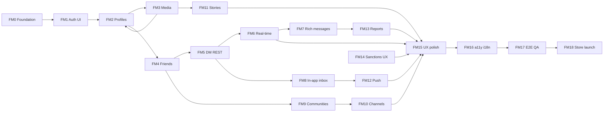

# Mobile Development Roadmap

Native iOS and Android client (monorepo: `mobile/`, consumed by an Expo/React Native app shell). Backend APIs for M1–M14 are implemented; **`mobile/` currently holds Clean Architecture scaffolding (use cases, HTTP repositories, screen controllers) without a runnable RN/Expo UI yet**.

This roadmap is **client-only**. It assumes backend milestones **M1–M14** (and M9 channel APIs when complete) remain the HTTP/WS contract source of truth. Do not add new server domains from the mobile track—extend backend first, then attach UI.

## Principles

1. **One major UX domain per milestone** — finish auth before chat; finish DM before communities (same sequencing as backend M15 → M17).
2. **Backend contract first** — every screen maps to existing REST/WS endpoints; mock only when backend is temporarily unavailable in dev.
3. **Thin presentation, fat use cases** — keep business orchestration in `mobile/src/application/`; React components call existing screen controllers / use cases.
4. **Shared types** — DTOs and enums from `packages/shared-types`; do not duplicate backend shapes in the UI layer.
5. **Platform parity** — iOS and Android ship the same feature set each milestone; platform-specific code stays in `infrastructure/` adapters (secure storage, push, deep links).
6. **Incremental real-time** — REST thread UI (FM5) before WebSocket live updates (FM6); never both as first cut for the same feature.
7. **Testable increments** — each milestone has unit tests (mocked repos), component tests where valuable, and a manual two-device smoke path.

## Backend dependency map

| Mobile milestone | Requires backend | Notes |
|------------------|------------------|-------|
| FM0 | M0 | Health check, config |
| FM1 | M1 | Auth, refresh, devices |
| FM2 | M2 | Profiles, aliases |
| FM3 | M3 | Media upload pipeline |
| FM4 | M4 | Friendships |
| FM5 | M5 | DM REST |
| FM6 | M6 | WebSocket messaging |
| FM7 | M7 | Rich message types |
| FM8 | M11 | In-app notifications |
| FM9 | M8 | Communities |
| FM10 | M9 | Community channels |
| FM11 | M10 | Stories |
| FM12 | M12 | Push dispatch |
| FM13 | M13 | User reports |
| FM14 | M14 | Sanctions surfaced to client |
| FM15–FM18 | M18 optional | Polish and launch |

## Major systems map



---

## Milestone 0 — Mobile platform foundation

**Scope:** Runnable Expo app on iOS simulator and Android emulator; wire `@platform/mobile` package; navigation skeleton; theme; dev/prod API config. **Not in scope:** auth screens, feature flows.

| Work | Surfaces |
|------|----------|
| ADR: Expo SDK version, RN architecture (New Architecture on/off), state approach | `docs/adr/` |
| Expo app shell | `mobile/app/` or `apps/mobile-native/` (choose in ADR; keep `@platform/mobile` as shared library) |
| Dev builds | EAS Build or local `expo run:ios` / `expo run:android` |
| API base URL config | `.env.development`, staging, production |
| Navigation root | Tab + stack placeholder (matches `AppShellController` tabs) |
| Theme tokens | Colors, typography, spacing; dark mode baseline |
| Error boundary + global toast/snackbar | `presentation/` |
| CI job | Lint + unit tests for `@platform/mobile`; optional Expo export check |

**Exit criteria (testable):**

- [ ] App launches on iOS simulator and Android emulator; shows placeholder tabs.
- [ ] `GET /health` reachable from device/simulator against local or staging backend.
- [ ] `@platform/mobile` imports resolve in the Expo app; existing Vitest suite passes in CI.

**Manual smoke:** Clone → `npm install` → start backend → launch app → health indicator green.

---

## Milestone 1 — Authentication and session persistence

**Scope:** Register, login, logout, session restore, token refresh. **Not in scope:** profile editing, social features.

| Work | Details |
|------|---------|
| Auth screens | Email/password register & login; validation UX |
| Secure storage | iOS Keychain + Android Keystore via adapter implementing `TokenStorage` |
| Session bootstrap | On launch: read tokens → refresh if needed → route to main or auth |
| API client interceptor | Attach Bearer access token; 401 → refresh once → retry |
| Logout | Clear storage; call `/auth/logout`; reset navigation |
| Wire existing use cases | `LoginUseCase`, `RegisterUseCase`, `AuthScreen` controller |
| Device register stub | Call M1 device API after login (push token empty until FM12) |

**Exit criteria:**

- [ ] Unit tests: token refresh path with mocked repo (existing + new refresh-on-401 test).
- [ ] Manual: register → kill app → relaunch → still authenticated.
- [ ] Manual: logout → cannot access protected routes.

**Manual smoke:** Two accounts created on one device; switch accounts via logout/login.

---

## Milestone 2 — Profile and public alias

**Scope:** View/edit own profile; claim/rename `@alias`; view others by alias. **Not in scope:** avatar upload (FM3).

| Work | Details |
|------|---------|
| Profile tab | Display name, bio, alias, locale, timezone |
| Edit profile form | PATCH profile; optimistic or save button |
| Alias flow | Claim primary alias; rename with confirmation |
| Public profile screen | Deep link / search by `@alias` (read-only) |
| Wire use cases | `ProfileScreen`, profile HTTP repository |

**Exit criteria:**

- [ ] Unit tests: profile update and alias validation errors surfaced to UI.
- [ ] Integration: alias shown on profile after claim; duplicate alias shows user-friendly error.

**Manual smoke:** Set alias → open public profile view from friend tab (FM4 prep).

---

## Milestone 3 — Media capture and upload

**Scope:** Pick/capture images; upload via M3 presigned flow; show upload progress. **Not in scope:** sending media in chat (FM7).

| Work | Details |
|------|---------|
| Permissions | Camera, photo library (iOS `Info.plist`, Android manifest) |
| `MediaPicker` UI | Gallery + camera; mime/size pre-check |
| Upload orchestration | init → PUT to storage → complete; handle `processing` → poll `ready` |
| Avatar | Set profile avatar from FM2 screen |
| Thumbnail display | Use signed GET URLs from media API |
| Reuse | `MediaPicker`, `UploadMediaUseCase`, `http-media-repository` |

**Exit criteria:**

- [ ] Unit tests: upload state machine (uploading → ready / failed).
- [ ] Manual: pick photo → avatar updates on profile after refresh.

**Manual smoke:** Upload image → verify in profile; delete media from settings if exposed.

---

## Milestone 4 — Friends and social graph

**Scope:** Friend list, incoming/outgoing requests, accept/decline, block. **Not in scope:** messaging, discovery recommendations.

| Work | Details |
|------|---------|
| Friends tab | Sections: friends, incoming, outgoing |
| User lookup | By alias or user id (from M2 public profile) |
| Actions | Send request, accept, decline, block/unblock |
| Empty states | No friends yet CTA |
| Wire | `FriendsScreen`, friend use cases |

**Exit criteria:**

- [ ] Unit tests: list merging incoming/outgoing; block hides actions.
- [ ] Manual two-account: A requests B → B accepts → both see friendship.

**Manual smoke:** Block user → request button disabled/hidden per product rule.

---

## Milestone 5 — Direct messaging (REST)

**Scope:** Conversation list, 1:1 thread, text send/receive via HTTP, pagination, read receipts via REST. **Not in scope:** live WS updates (FM6), attachments (FM7).

| Work | Details |
|------|---------|
| Chats tab | Conversation list sorted by `updatedAt`; unread badge from participant state |
| Thread screen | Message bubbles, sender alignment, timestamps |
| Compose | Send text; disable when not friends (M4 policy) |
| Pagination | Load older messages on scroll |
| Mark read | Update `last_read_at` on thread focus |
| Mute | Toggle mute on conversation |
| Create DM | Start chat from friend profile |
| Wire | `ChatScreen`, chat use cases, `http-chat-repository` |

**Exit criteria:**

- [ ] Unit tests: message list ordering; send appends locally after API success.
- [ ] Manual two-device: A sends → B pull-to-refresh sees message (REST only).

**Manual smoke:** 50+ messages paginate smoothly; edit/delete reflected after refresh (if backend supports).

---

## Milestone 6 — Real-time messaging

**Scope:** WebSocket connection for direct chats; live message append; reconnect. **Not in scope:** new message types, push.

| Work | Details |
|------|---------|
| WS client | Connect to `/ws` with Bearer token; heartbeat/reconnect backoff |
| Room join | Subscribe on thread open; leave on blur |
| Event handlers | `message.created`, `message.updated`, `message.deleted` |
| UI merge | Dedupe by message id; append without full reload |
| Connection indicator | Subtle disconnected banner |
| Wire | `ConnectRealtimeChatUseCase`, extend `http-chat-repository` |

**Exit criteria:**

- [ ] Unit tests: event handler updates local message list idempotently.
- [ ] Manual two-device: message appears on B within 2s without refresh.

**Manual smoke:** Toggle airplane mode → reconnect → missed messages backfilled via REST.

---

## Milestone 7 — Rich messages (media and location)

**Scope:** Image/video messages and location share in DM. **Not in scope:** community channels (FM10).

| Work | Details |
|------|---------|
| Attachment composer | Reuse FM3 upload → send media message |
| Location | OS permission; pick current location or pin; send location bubble |
| Renderers | Image preview, tap to fullscreen; map snapshot or static coords |
| WS payloads | Handle enriched M7 event shapes (version-tolerant) |
| Wire | Extend chat screen + media use cases |

**Exit criteria:**

- [ ] Unit tests: media message requires `ready` media id before send.
- [ ] Manual: send image in DM; recipient sees thumbnail + full view.

**Manual smoke:** Send location → other device opens maps link.

---

## Milestone 8 — In-app notifications

**Scope:** Notification inbox, unread count, mark read, preferences. **Not in scope:** OS push (FM12).

| Work | Details |
|------|---------|
| Notifications tab | List with icons by type; unread dot |
| Mark read | Single and mark-all |
| Preferences screen | Toggle per `notification_type` × in_app channel |
| Badge on tab | Unread count from API |
| Deep link prep | Parse payload JSON for FM12; navigate via `AppShellController.handleDeepLinkTarget` |
| Wire | `NotificationScreen`, notification use cases |

**Exit criteria:**

- [ ] Unit tests: mark read clears local unread count.
- [ ] Manual: friend request creates inbox row; preference off suppresses type.

**Manual smoke:** Tap notification row → navigates to relevant screen (chat, friends, etc.).

---

## Milestone 9 — Communities

**Scope:** Discover public communities, create, join/leave, member list, role badges. **Not in scope:** channel messaging (FM10).

| Work | Details |
|------|---------|
| Communities tab | My communities + discover |
| Community detail | Name, slug, visibility, avatar, member count |
| Create community | Form with slug validation |
| Join / leave | Public vs private rules from API errors |
| Member list | Show roles (owner, admin, moderator, member) |
| Wire | `CommunitiesScreen`, community use cases |

**Exit criteria:**

- [ ] Unit tests: join error surfaces for private/hidden communities.
- [ ] Manual: create → second user joins → both see community in list.

**Manual smoke:** Promote member to admin (if exposed in UI) or verify via API + refresh.

---

## Milestone 10 — Community channel messaging

**Scope:** Channel list per community; post/read messages using FM5/FM6/FM7 patterns. **Not in scope:** moderation tools (admin M16).

| Work | Details |
|------|---------|
| Channel list | `#general` style list inside community |
| Channel thread | Reuse chat components with `conversation_type = community_channel` |
| Permissions | Read-only UI when archived or not a member |
| Create channel | Admin+ only; hide action for members |
| WS rooms | Same FM6 client; authorize via backend |

**Exit criteria:**

- [ ] Manual: post in channel → member sees live update (FM6).
- [ ] Non-member cannot open channel (error screen).

**Manual smoke:** Join community → open `#general` → send text and image.

---

## Milestone 11 — Stories

**Scope:** Capture/publish story, friends feed, full-screen viewer, view tracking. **Not in scope:** story push (FM12).

| Work | Details |
|------|---------|
| Stories tab | Horizontal friend rings; unviewed indicator |
| Composer | Multi-item story; caption; TTL display |
| Viewer | Tap-through items; progress bars; swipe dismiss |
| View recording | Call record-view API on item shown |
| Viewers list | Author sees who viewed (optional screen) |
| Expiry | Hide expired stories from feed on refresh |
| Wire | `StoryScreen`, story use cases |

**Exit criteria:**

- [ ] Unit tests: `RecordStoryViewUseCase` called once per story session (idempotent UX).
- [ ] Manual: post story → friend views → author sees viewer.

**Manual smoke:** 24h story disappears from feed after expiry (or on next feed fetch).

---

## Milestone 12 — Push notifications

**Scope:** FCM (Android) + APNs (iOS); register device token; foreground/background handling; tap → deep link. **Not in scope:** email/SMS.

| Work | Details |
|------|---------|
| OS permission flow | Pre-prompt copy; settings deep link if denied |
| Token lifecycle | Register/update on M1 device API; refresh on token rotation |
| Handlers | Foreground in-app banner vs tray notification |
| Tap routing | `PushNotificationHandler` → `AppShellController.handleDeepLinkTarget` |
| Background | Cold start from notification opens correct screen |
| Wire | `RegisterPushDeviceUseCase`, `HandleDeepLinkUseCase` |

**Exit criteria:**

- [ ] Manual sandbox: background app receives push for new message (M12 backend).
- [ ] Tap opens correct chat/conversation.

**Manual smoke:** Disable push in preferences → no tray notification (in-app may still show per M11).

---

## Milestone 13 — Safety and reporting

**Scope:** Report user, message, community, story from contextual menus. **Not in scope:** moderator queue (admin).

| Work | Details |
|------|---------|
| Report sheet | Reason picker + optional details |
| Context actions | Long-press message; profile ⋮ menu; community/story report |
| Confirmation | Report id or success toast |
| Rate limit UX | Friendly message on 429 |

**Exit criteria:**

- [ ] Manual: report message → success; reporter can view own report status if API exposed.

**Manual smoke:** Report own content blocked; non-participant cannot report private message.

---

## Milestone 14 — User-facing moderation feedback

**Scope:** Client behavior when M14 sanctions apply. **Not in scope:** admin moderation UI.

| Work | Details |
|------|---------|
| Auth errors | Suspended/banned login messages; link to support |
| Send blocked | Mute/suspend prevents compose with clear copy |
| Removed content | Placeholder bubble for moderated messages |
| Force logout | On ban/suspend if refresh fails |

**Exit criteria:**

- [ ] Manual: suspended user sees block screen on next API call.
- [ ] Removed message shows placeholder in thread.

**Manual smoke:** Align copy with legal/support requirements.

---

## Milestone 15 — Cross-cutting UX polish

**Scope:** Production-quality feel across FM1–FM14. **Not in scope:** new features.

| Work | Details |
|------|---------|
| Loading skeletons | Lists and threads |
| Empty states | Every tab |
| Error retry | Network failures with retry button |
| Pull-to-refresh | Lists (chats, friends, notifications, communities) |
| Optimistic UI | Send message (rollback on failure) |
| Offline banner | NetInfo; queue sends optional (document if deferred) |
| Image caching | Avatar and chat thumbnails |

**Exit criteria:**

- [ ] No blank screens on slow 3G simulation.
- [ ] Consistent error component used app-wide.

**Manual smoke:** Airplane mode → user sees offline state; recovery works.

---

## Milestone 16 — Accessibility and localization

**Scope:** a11y baseline + locale from profile. **Not in scope:** full translation matrix for all languages.

| Work | Details |
|------|---------|
| Screen reader | `accessibilityLabel` on interactive elements |
| Dynamic type | Respect OS font scaling |
| Color contrast | WCAG AA for theme tokens |
| Reduce motion | Honor OS setting for animations |
| i18n scaffold | `i18next` or Expo localization; English default; load `profile.locale` |
| RTL | Layout direction hook (verify one RTL locale) |

**Exit criteria:**

- [ ] VoiceOver/TalkBack walkthrough of auth + send message path documented.
- [ ] One non-English locale stub loads without layout breaks.

**Manual smoke:** Increase font size in OS settings → no clipped text on auth screen.

---

## Milestone 17 — E2E and device QA

**Scope:** Automated and manual release gates. **Not in scope:** backend load tests (M18).

| Work | Details |
|------|---------|
| E2E framework | Maestro (recommended) or Detox; run on CI macOS runner for iOS, Linux for Android |
| Critical flows | Login → friend request → accept → send message → WS receive |
| Extended flows | Community join → channel post; story view; push tap |
| Two-device protocol | Document physical device test script in `docs/guides/` |
| Test accounts | Seed script or documented credentials for staging |

**Exit criteria:**

- [ ] E2E green on PR for smoke flow.
- [ ] Two physical devices complete friend chat checklist.

**Manual smoke:** Run E2E against staging before each release candidate.

---

## Milestone 18 — App store and production readiness

**Scope:** Ship to TestFlight / Play Internal Testing; production config. **Not in scope:** new product features.

| Work | Details |
|------|---------|
| App identity | Icons, splash, display name |
| iOS | Privacy manifest, App Store Connect metadata, ATS config |
| Android | Data safety form, target API level, signing |
| Secrets | EAS secrets; no keys in repo |
| Crash reporting | Sentry or equivalent |
| Performance | Startup time, memory on chat thread budget |
| OTA policy | Document Expo Updates scope (JS-only) |
| Staging vs prod | Bundle IDs / applicationIds separate |

**Exit criteria:**

- [ ] TestFlight and Play internal build installable by team.
- [ ] Crash-free sessions > 99% on internal track for 7 days.
- [ ] Security checklist: token storage, cert pinning decision recorded in ADR.

**Manual smoke:** Fresh install from store track → full FM17 smoke on production API.

---

## Suggested timeline (indicative)

| Phase | Milestones | Focus |
|-------|------------|-------|
| Phase A — Shell & identity | FM0–FM3 | Expo app, auth, profile, media |
| Phase B — Social & chat | FM4–FM7 | Friends, DM REST, WS, rich messages |
| Phase C — Engagement | FM8–FM12 | In-app inbox, communities, channels, stories, push |
| Phase D — Safety & polish | FM13–FM16 | Reports, sanctions UX, UX/a11y |
| Phase E — Launch | FM17–FM18 | E2E, store submission |

Backend M9 (community channels) must be exit-complete before FM10 starts. Do not overlap FM9 and FM5 if both are unfinished—chat stability first.

---

## Testing strategy (per milestone)

| Layer | When |
|-------|------|
| Use case unit tests (mock repos) | Every FM with application logic |
| Component tests | FM1+ for forms and lists (React Native Testing Library) |
| Contract alignment | Verify payloads against `packages/shared-types` when backend changes |
| Manual two-device smoke | FM4 onward for social features |
| Maestro/Detox E2E | FM17 gate; subset from FM5/FM6 onward in dev |
| Physical device matrix | FM12+ for push; FM18 for store |

**Definition of done for any mobile milestone:** exit criteria checked, staging demo recorded or script updated, no P0 crashes on iOS/Android for that feature path, backend dependency version noted in PR description.

---

## Architecture notes

```
Expo app (presentation UI: React components)
    ↓ calls
@platform/mobile screen controllers + use cases
    ↓ uses
infrastructure: http-* repositories, token storage, ws client, push adapter
    ↓ types from
packages/shared-types, packages/domain-core
```

- Keep **domain and application** free of `react-native` imports.
- Add **`mobile/src/infrastructure/platform/`** for Keychain, push, NetInfo, linking.
- Prefer **one navigation coordinator** that wraps `AppShellController` state.

Record mobile stack choices (Expo SDK, navigation library, secure storage library) in **`docs/adr/0003-mobile-platform-stack.md`** during FM0.

---

## Out of scope (v1 mobile roadmap)

- Desktop or web client
- End-to-end encryption UI
- Bluetooth / offline mesh messaging
- Full user search / recommendation feed
- In-app purchases or subscriptions
- Custom keyboard / IME extensions
- Wear OS / watchOS companions
- Admin/moderation dashboard (see backend M16 / `admin/`)

Track these only after FM18, one system at a time.

---

## Related docs

- [Backend development roadmap](./development-roadmap.md)
- [Clean Architecture](../architecture/clean-architecture.md)
- [ADR 0002: Auth token model](../adr/0002-m1-auth-token-model.md)
- `mobile/README.md` — layer map for `@platform/mobile`
